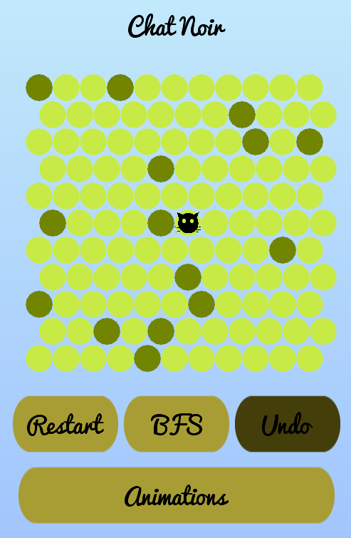
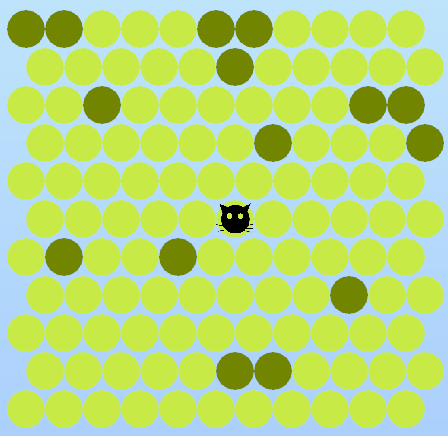
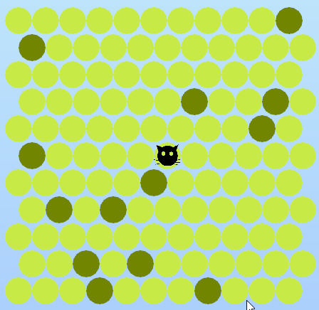

## Chat Noir

LibGDX clone of orginal Chat Noir flash game.

### Implementation

Player objective is to stop cat for reaching the border tiles of the map.
Cat can use breadth-first search algorithm or A* to find shortest path to escape. Animations of algorithms can bu turn on by clicking on Animation button.

|   A*   |  BFS  |
|--------|-------|
| | |

There are option to undo turn but it can be use only once per move.

Thanks to libGDX game can be run on desktop or android.

### Resources
Font:

https://www.fontsquirrel.com/fonts/pacifico

Skin:

https://github.com/czyzby/gdx-skins/tree/master/lgdxs created by [Raymond "Raeleus" Buckley](https://ray3k.wordpress.com/software/skin-composer-for-libgdx/)
